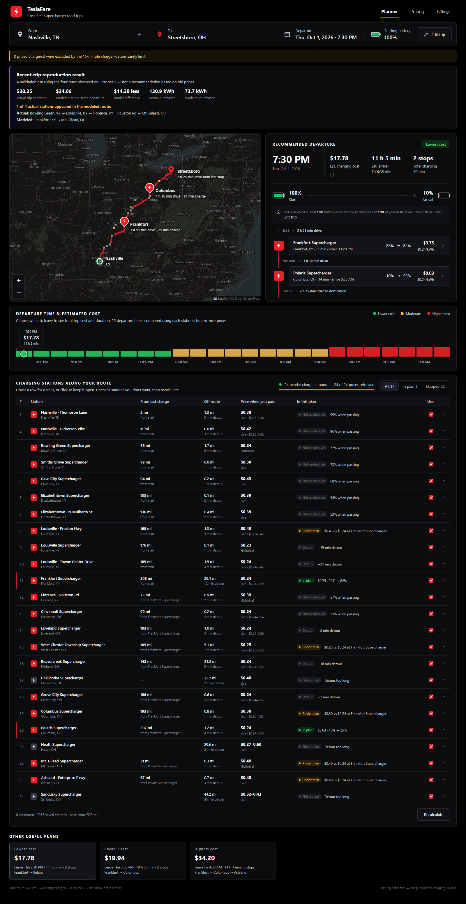
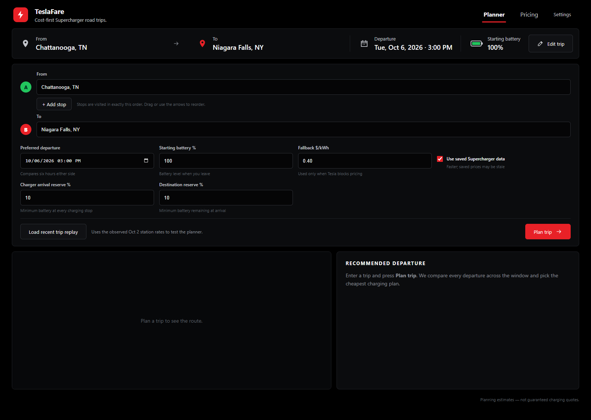

<div align="center">

# ⚡ TeslaFare

### Find the lowest-cost time and place to charge on a Tesla road trip.

[](https://www.python.org/)
[](https://fastapi.tiangolo.com/)
[](#testing)
[](#privacy-and-data)

TeslaFare compares departure times, real road distances, battery state, charging curves, and available time-of-use prices to build a practical, cost-aware Supercharger plan.

[Quick start](#quick-start) · [How it works](#how-it-works) · [Configuration](#configuration) · [Deploy](#deploying) · [Contributing](#contributing)

</div>

> [!IMPORTANT]
> This is an independent, unofficial project. It is not affiliated with or endorsed by Tesla. Results are planning estimates—not guaranteed prices, range predictions, or navigation instructions.

## Why this project exists

Tesla's built-in trip planner is excellent at getting a Tesla to its destination with convenient Supercharger stops. [A Better Routeplanner](https://abetterrouteplanner.com/) is excellent at detailed energy modeling and building a feasible EV route. Other tools focus on fewer stops, faster charging, live availability, or simply finding chargers near the road.

But during a long road trip, there is another question that most planners do not treat as the primary objective:

> **What is the cheapest realistic charging plan for this trip?**

Supercharger prices can differ significantly between nearby locations and across time-of-use windows. The nearest charger may not be the cheapest. The fastest route may cost more. A tiny charge at one station may be worthwhile if it makes a much cheaper station reachable. Leaving slightly earlier or later can also change the total.

That is the gap this project is built to explore.

Instead of only finding chargers that make the route possible, it compares **cheap-to-expensive complete plans** using:

- public Tesla Supercharger prices when they can be verified;
- the price active at the estimated time of charging;
- road distance and driving time between stations;
- starting battery, energy use, and the charging curve;
- minimum battery reserves at chargers and the destination;
- charging time, detours, and optional intermediate stops.

The current version considers **Tesla Superchargers only**. It is most useful before a road trip, when you can trade a little time or a small detour for lower charging cost and want to understand exactly why a plan was selected.

This is not intended to replace Tesla navigation or ABRP. Use it as the **cost-planning layer** before the drive, then use your preferred navigation tool on the road.



The planner still enforces the battery reserves and detour limits you choose. “Cheapest” never means pretending the car can reach an impossible stop.

## Highlights

- **Cost-first route optimization** across multiple departure times and charging strategies.
- **Ordered intermediate stops** with optional dwell time, useful for pickups, meals, or planned visits.
- **Time-of-use pricing** evaluated in each station's local timezone.
- **Editable safety reserves** for charger arrival and final destination arrival.
- **Transparent recommendations** that explain bridge charges, price decisions, and route constraints.
- **Per-leg travel times** that distinguish driving, charging, and stop duration.
- **Interactive route map** showing the route, requested stops, candidate chargers, and selected chargers.
- **Station controls** for excluding unwanted chargers or entering a clearly labeled manual fallback price.
- **Local-first caching** with SQLite and a human-readable Supercharger knowledge store.
- **No paid API required** for the default development setup.

## Product tour

### 1. Describe the trip

Enter an origin and destination, add up to eight ordered stops, choose a preferred departure time, and set the starting battery and reserve levels.



### 2. Compare complete plans

The planner evaluates departure windows and charger sequences, then presents useful alternatives such as lowest cost, balanced, and fastest reasonable. Every plan includes:

- estimated charging cost and arrival time;
- SOC before and after each charge;
- driving time between every stop;
- charging and waypoint dwell time;
- active reserve rules;
- the price used at each charger.

### 3. Understand unusual recommendations

If the route buys a small amount of expensive energy before visiting a cheaper nearby charger, the UI labels it as a **bridge charge** and explains which reserve rule made it necessary. The goal is for a surprising plan to be understandable—not merely mathematically valid.

### 4. Inspect the data

Open **Pricing** in the app, or visit `/debug/prices`, to inspect the most recent public pricing response, timestamp, source URL, and any fetch error for every station.

## Quick start

### Requirements

- Python **3.11 or newer**
- [`uv`](https://docs.astral.sh/uv/getting-started/installation/)
- Internet access for geocoding, routing, charger discovery, map tiles, timezone resolution, and public pricing

### Install and run

```bash
git clone https://github.com/shivardev/TeslaFare.git
cd TeslaFare
uv sync
uv run uvicorn app.main:app --reload
```

Then open [http://localhost:8000](http://localhost:8000).

| Page | URL |
|---|---|
| Planner | `http://localhost:8000/` |
| Pricing diagnostics | `http://localhost:8000/debug/prices` |
| Health check | `http://localhost:8000/health` |
| OpenAPI schema | `http://localhost:8000/openapi.json` |

> [!TIP]
> The first search is the slowest because station, route, timezone, and pricing data must be collected. Later searches reuse the local cache.

## Demo workflow

Try this route after starting the app:

1. Set **From** to `Chattanooga, TN`.
2. Set **To** to `Niagara Falls, NY`.
3. Optionally add a stop and its dwell time.
4. Confirm the starting battery and the two reserve fields.
5. Select **Plan trip**.
6. Compare departure bars, select another plan, and inspect its charger sequence.
7. Expand **View all stations** to compare route distance, detour, price status, and eligibility.

The included **recent trip replay** provides another quick way to explore the recommendation and validation UI using observed station rates.

## How it works


Each search state tracks the current location, timestamp, SOC, purchased energy, charging cost, driving time, charging time, dwell time, miles, and visited stops. At a charger, the optimizer considers both standard charge targets and the exact energy required to reach a useful downstream node while retaining the selected reserve.

```text
energy used (kWh) = road miles × Wh/mi ÷ 1000
SOC used (%)      = energy used ÷ usable battery capacity × 100
```

Completed plans are ranked primarily by charging cost, with time used as a tie-breaker. Detour and total-extra-driving limits prevent absurd money-saving routes.

## Data sources

| Provider | Used for | Notes |
|---|---|---|
| [Photon](https://photon.komoot.io/) and US Census | Geocoding | Fallback chain; results cached locally |
| [OSRM](https://project-osrm.org/) | Road geometry, distance, duration, routing matrix | Public demo by default; self-host for serious traffic |
| [Supercharge.info](https://supercharge.info/) | Open Supercharger discovery | Not used as the price source |
| [TimeAPI](https://timeapi.io/) | Coordinate → IANA timezone | Required for correct local time-of-use windows |
| [Tesla Find Us](https://www.tesla.com/findus) | Public station pricing when available | Unauthenticated public data only |
| [OpenStreetMap](https://www.openstreetmap.org/) | Map tiles | Displayed through Leaflet |

The pricing pipeline does **not** log in to Tesla, use private vehicle APIs, bypass CAPTCHAs, or invent a price when public data is unavailable.

## Pricing states

| Status | Meaning |
|---|---|
| Live / verified | Parsed from a current public Tesla response |
| Cached / historical | Previously observed public pricing reused locally |
| Manual | Explicitly entered by the user |
| Estimated | The configured fallback planning price |
| Unknown | No reliable price was available; excluded from cost optimization |

Dynamic or future pricing that cannot be known reliably stays unknown. A clear failure is safer than a confident-looking fictional total.

## Configuration

The application reads environment variables directly. A `.env` file is **not automatically loaded**.

```bash
# Search behavior
DEPARTURE_SEARCH_HOURS=24
DEPARTURE_INTERVAL_MINUTES=30
CORRIDOR_MILES=50
MAX_CANDIDATE_CHARGERS=24
MAX_CHARGER_DETOUR_MINUTES=15
MAX_TOTAL_EXTRA_DRIVING_MINUTES=60

# Pricing browser fallback
TESLA_PLAYWRIGHT_FALLBACK=true
TESLA_BROWSER_BACKEND=selenium
TESLA_PLAYWRIGHT_HEADLESS=true
TESLA_PLAYWRIGHT_MAX_FALLBACKS=40

# Persistence
CACHE_DB_PATH=.data/cache.sqlite3
CHARGER_KNOWLEDGE_PATH=.data/superchargers.json
```

See [`.env.example.md`](.env.example.md) for the complete list.

On PowerShell:

```powershell
$env:MAX_CHARGER_DETOUR_MINUTES="20"
$env:TESLA_PLAYWRIGHT_HEADLESS="true"
uv run uvicorn app.main:app --reload
```

### Vehicle model

The default vehicle assumptions live in [`app/config/vehicle.py`](app/config/vehicle.py). Update the usable battery capacity, highway efficiency, and approximate charging curve to match the vehicle and conditions you intend to model.

The charger-arrival reserve, destination reserve, and starting SOC can be changed for each trip in the UI.

## Privacy and data

Route and provider data are stored locally by default:

```text
.data/cache.sqlite3
.data/superchargers.json
```

The repository ignores `.data/`, `.env`, virtual environments, Python caches, and test caches. Delete the two data files to clear locally saved provider results and station knowledge.

Trip inputs are necessarily sent to the configured geocoding and routing providers. If that is inappropriate for your use case, point the provider environment variables at services you control.

## Deploying

### Docker (recommended)

The image bundles the app, headless Firefox and geckodriver (needed because Tesla's public price pages reject plain HTTP requests).

```bash
git clone <this repo> && cd Tesla-Route-Planner
docker compose up -d --build
```

Open `http://<server-ip>:8000`. The container is named `tesla-route-planner`, restarts automatically (`unless-stopped`, including after a reboot once Docker starts), and reports health from `/health`.

| Task | Command |
|---|---|
| Status and health | `docker ps --filter name=tesla-route-planner` |
| Live logs | `docker compose logs -f` |
| Update after `git pull` | `docker compose up -d --build` |
| Use another host port | `HOST_PORT=9000 docker compose up -d` |
| Stop | `docker compose down` (keeps saved data) |

Saved prices and caches live in the `tesla-data` named volume, so they survive restarts and rebuilds. `docker compose down -v` deletes them. To start from data you already collected locally:

```bash
docker compose cp .data/superchargers.json tesla-route-planner:/data/superchargers.json
docker compose exec -u root tesla-route-planner chown app:app /data/superchargers.json
docker compose restart
```

The first trip on an empty volume takes a minute or two while prices are fetched through Firefox; later trips reuse saved prices. Settings in `docker-compose.yml` can be overridden from the shell or a `.env` file next to it (for example `MAX_CANDIDATE_CHARGERS=30`). There is no login: keep the port on a trusted network or put an authenticating reverse proxy in front of it.

### Without Docker

A basic single-instance deployment can run:

```bash
uv sync --frozen
uv run uvicorn app.main:app --host 0.0.0.0 --port ${PORT:-8000}
```

For a public deployment:

- persist the `.data` directory between releases;
- run behind HTTPS and a reverse proxy;
- set `TESLA_PLAYWRIGHT_HEADLESS=true`;
- install the browser required by the selected pricing backend;
- respect the usage policies and capacity limits of every upstream provider;
- self-host OSRM/geocoding for meaningful public traffic;
- add rate limiting and request-size limits before exposing the optimizer broadly;
- monitor public pricing fetch failures, since Tesla can change its public response at any time.

This codebase is best suited today to personal use, a trusted small group, or a demonstration deployment. The default public provider endpoints do not provide production SLAs.

## Testing

The test suite is synthetic and does not require external providers:

```bash
uv run pytest -q
```

Coverage includes energy math, SOC feasibility, charging curves, time-of-use pricing, geocoding fallback, route graphs, ordered waypoints, bridge-charge explanations, departure selection, charger knowledge, and optimizer behavior.

## Project structure

```text
app/
├── chargers/       # Supercharger discovery and durable station knowledge
├── config/         # Runtime and vehicle assumptions
├── db/             # SQLite cache
├── geocoding/      # Census + Photon fallback chain
├── optimizer/      # Graph construction, search, and explanations
├── pricing/        # Price schedules and Tesla public-price retrieval
├── routing/        # OSRM integration
├── static/         # Browser JavaScript and CSS
├── templates/      # Planner and diagnostics pages
├── vehicle/        # Energy and charging models
├── main.py         # FastAPI application and orchestration
└── models.py       # API/domain models

tests/              # Offline unit and behavior tests
docs/images/        # README screenshots
```

## Known limitations

- Range estimates do not yet model elevation, temperature, wind, precipitation, HVAC, payload, tire setup, or live traffic.
- Charging duration is based on a configurable approximate SOC-band curve, not the car's live battery temperature or stall conditions.
- Public pricing can be incomplete, delayed, dynamic, or changed upstream without notice.
- The optimizer scans discrete departure intervals and does not yet deliberately wait at a charger for a cheaper price window.
- The default OSRM service has no live traffic and is not intended as production infrastructure.
- Estimated costs exclude taxes, parking, idle, congestion, membership, and other fees unless represented in the selected price schedule.

## Contributing

Issues and pull requests are welcome.

1. Fork the repository and create a focused branch.
2. Run `uv sync`.
3. Make the change with tests.
4. Run `uv run pytest -q`.
5. Describe the user-visible behavior and external-provider assumptions in the pull request.

Good first contribution areas include weather/elevation adjustments, TeslaMate efficiency history, intentional wait actions for time-of-use pricing, saved trip comparisons, accessibility, and deployment packaging.

## Open-source checklist

Before announcing a public hosted instance, add the license you want contributors and users to follow. A repository without a license is publicly visible but does not grant open-source reuse rights. Also consider adding a security policy and a code of conduct as the community grows.

---

<div align="center">

Built for drivers who would rather spend electrons intelligently.

**[Back to top](#-route-intelligence)**

</div>
